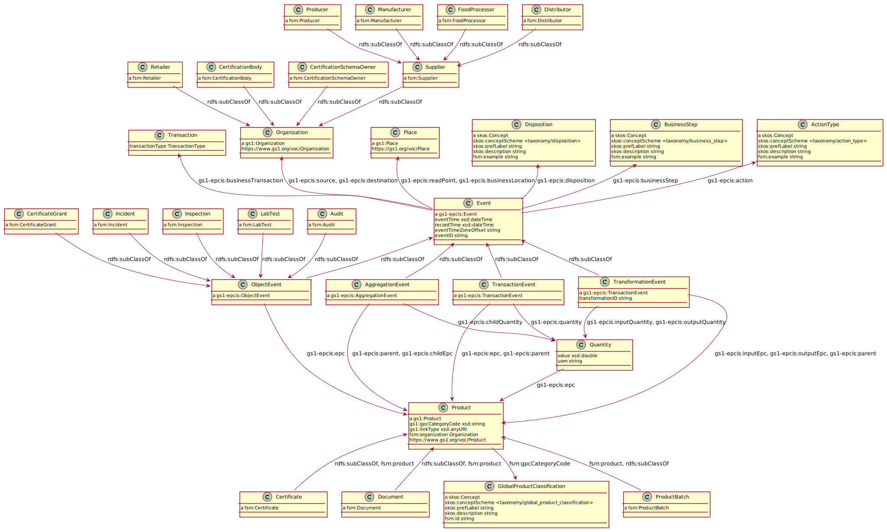
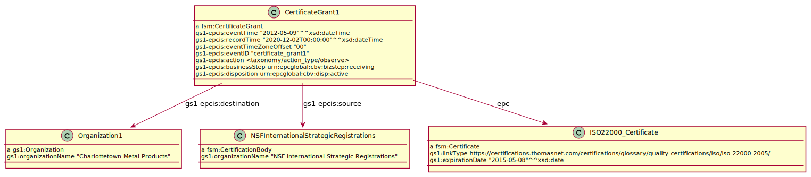

<!--TOC-->

- [Walkthrough](#walkthrough)
- [The FSM model](#the-fsm-model)
  - [Certification](#certification)
  - [Document](#document)
- [Use cases](#use-cases)
  - [The retailer (Agroknow)](#the-retailer-agroknow)
  - [Food authority](#food-authority)
  - [Certification Body && The Certification Body for Organic PDO Wine Production (Valoritalia)](#certification-body--the-certification-body-for-organic-pdo-wine-production-valoritalia)
  - [Broilers example](#broilers-example)
- [The EPCIS model](#the-epcis-model)
- [Types of events](#types-of-events)
  - [EPCISEvent](#epcisevent)
  - [ErrorDeclaration](#errordeclaration)
  - [ObjectEvent ](#objectevent-)
  - [AggregationEvent](#aggregationevent)
  - [TransactionEvent](#transactionevent)
  - [TransformationEvent](#transformationevent)

<!--TOC-->

# Walkthrough
There is a GS1 OWL ontology describing the  clothing, shoes, food beverage/tobacco and properties common to all products and locations.

A browsable webiste is available which lists all the fields and classes:
https://www.gs1.org/voc/?show=classes

EPCIS is a GS1 standard for describing events.
Currently no RDF representation is available.

In the sections below we will try to illustrate a model for representing EPCIS data in RDF.

The diagrams are generated using _rdfpuml_ available [here](https://github.com/nikolatulechki/rdf2rml)  


# The FSM model


The model for the project is an extension of the EPCIS model.
## Certification
TODO: we need certification classification

In order to express certification of producers, food processors and other parties involved in the supply chain we need to handle two generic cases.
1. Organization level certification


In this example we are expressing an ISO 22000:2005 certificate. 

We treat the certificate as a product of the Certification Body. The certification body gives the 
certificate to the Organization


2. Product level certification


In this example we are expressing a Halal certificate. These certificates are provided
only for some products provided by a company.

We treat the certification grant in the same manner as the above example.

The new thing is that the certificate node links
to a product. This product is a GTIN prefix for a company product. All batches of this product will be linked to it with the fsm:product link.

## Document
The documents are represented in a similar manner as the certifications. 
We treat as documents these classes:
* Incidents
* Audits
* Inspection
* Lab tests

They can be expressed using the same logic.

In this example we will use an incident from the FOODAKAI API.
```
"id":"FDK_18341544",
'                 "title":"Other hazard in ready to eat - cook meals by «  1001 France » from France",
'                 "description":"Date : 29 NOVEMBRE 2020\r\nINFORMATION CONSOMMATEURS\r\nRAPPEL DE PRODUIT\r\nLa Société «  1001 FRANCE » procède aujourd’hui au retrait de la vente de sa \r\nrecette « Mon mijoté de courges butternut et bœuf »  suite à la mise en évidence de \r\npossibles morceaux de graines de courges dans le produit.\r\nIl s’agit des lots portant les caractéristiques suivantes : \r\nNature du Produit   :  Repas complet pour bébé\r\nMarque : HAPPYLAL BABY\r\nGENCOD : 3770007731081\r\nFORMAT   :   220 grammes\r\nDLC   :  15/03/2021 (LOT : MEL46V11) et 09/05/2021(LOT : MEL02B06)\r\nCode emballeur/Estampille Sanitaire   (ou numéro de lot) :  FR 29.174.020 CE\r\nL’ensemble des lots sont retirés de la commercialisation.\r\nCertains de ces produits ont cependant été commercialisés avant la mesure de \r\nretrait.\r\nIl est donc recommandé aux personnes qui détiendraient des produits appartenant aux \r\nlots  décrits  ci-dessus  de ne pas les  consommer et  de les  détruire  ou  de les \r\nrapporter au point de vente.  \r\nLa société « 1001 FRANCE » se tient à la disposition des consommateurs pour \r\nrépondre à leurs questions au numéro de téléphone : « 06 62 26 38 63 ».\r\nAfficher jusqu’au 29 décembre 2020",
'                 "entityType":"incident",
'                 "createdOn":"2020-11-29T00:00:00",
'                 "updatedOn":"2020-11-30T14:05:06.916673",
'                 "dataSource":"FOODAKAI",
'                 "tags":[
'                    "france",
'                    "ready to eat - cook meals",
'                    "other hazard",
'                    "prepared dishes and snacks",
'                    "europe"
'                 ],
'                 "published":true,
'                 "privateData":0,
'                 "linkedEntities":[
'                    {
'                       "id":"FDK_18341542",
'                       "title":"«  1001 France »",
'                       "description":"",
'                       "entityType":"supplier",
'                       "createdOn":"2020-11-30T14:05:06.916704",
'                       "updatedOn":"2020-11-30T14:05:06.916707",
'                       "dataSource":"FOODAKAI",
'                       "tags":[
                         
'                       ],
'                       "published":true,
'                       "privateData":0,
'                       "linkedEntities":[
                         
'                       ],
'                       "internalId":null
'                    }
'                 ],
'                 "internalId":"18341544"
'              },
```

The example:


We treat the FOODAKAI as the source organization of the event as such information is not provided in by FOODAKAI and no one outside Agroknow is able to validate it. 
The example incident has structured information only for the organization which supplied the food product that has lead to the incident. 
In the FSM Platform we would like to be able to identify a product or a batch of product.
In order to accomodate for such granularity we use the `fsm:product` relation to a product.

# Use cases

## The retailer (Agroknow)
We use these requirements:
1. Browse information
2. list of the Certification Bodies and Certification Schema owners that the supplier (producer, processor) is working with. 
3. able to perform a remote supplier verification using critical information like incidents, inspection results, certificates and lab tests
4. able to perform a supplier risk assessment in order to prioritise the audits and lab tests
5. Be able to access fully traced information
6. Be able to access information regarding findings of the inspection of suppliers in the food chain
7. Be able to access current status of food supply actors, as far as audit results of certify organizations are concerned
8. Have access to innovative tools


How we cover the above requirements:
1. Based on the FSM model we can browse organizations, products, product batches.
These organizations can be Retailers, Suppliers, Certification bodies etc. 
We can query the database for Events regarding these objects.
The events can be transactions between organizations, transformations of a products to a new product,
 certification grants, lab tests etc.
2. Certification bodies can be listed by querying for objects of type `fsm:CertificationBody`
3. We can query directly inspection results, certificates and lab tests relating to a organization.
This can be done using the event objects `fsm:Inspection`, `fsm:CertificateGrant`, `fsm:LabTest`, `fsm:Audit` respectively.
The incidents are usually harder to trace back. Based on the presumption that we have the full supply chain data
we can query the graph for all the events and parties involved with this product.
The entry point for such an analysis should be the `fsm:Incident` object.
4. This functionality should be extracted from the raw data within the FSM model.
It should be part of down-stream processing.
5. As per 3. we can fully trace a product batch through the supply chain as long as we have the full data for it.
6. This is part of 3. browsing inspection results should give you the access to view the information within the system.
7. Current state should be logically aggregated based on historical event data. 
All the data will be within the system and will be queryable.
Question like: How long results of Insepction/Audit are relevant after their release?
8. This should be part of another layer above the database.

## Food authority
Based on an overview of the responsibilities of 2 EU food authorities 
(Bulgarian Food Safety Agency, Netherlands Food and Consumer Product Safety Authority) 
we have extracted their obligations:
* Animal Health - Keep animals healthy. Animal welfare. Animal products processing secure
* Plant health - Plant diseases and prevent pests
* Food safety - Supervising the production, preparation, transport and sale of food products and sale of tobacco products.
* Product safety - Safe personal care products, indoor and outdoor games, consumer products in and around the house.
* Border inspections

The data we deem necessary for the FSM Platform are the:
* Reports of inspections - they could include information about safety risks [e.g.](https://english.nvwa.nl/news/news/2017/08/03/nvwa-website-publishes-codes-of-fipronil-contaminated-eggs-from-investigated-farms)
* News of new regulations - [e.g.](https://english.nvwa.nl/news/news/2020/11/30/bird-flu-avian-influenza-now-as-well-in-belgium-and-poland-mandatory-additional-cleansing--disinfection-transport-vehicles-in-the-netherlands). 
In order to make this type of data queryable it would require to add the concepts of
geo locations. As such regulations are issued for specific countries.

Currently we decided to use only the reports of inspections.

For example of inspections are part of the Documents heading explained above.
## Certification Body && The Certification Body for Organic PDO Wine Production (Valoritalia)
An example to the use cases involving certifications can be seen below.


The organization `BroilerFarm` has Halal certificate for  broilers. 
The `Broiler2` is a product batch for broiler.
Based on the hatching of the broiler and the time of its slaughter we can deduce wether the certificate is
relevant to this exact broiler batch.
For the example we assume that the hatching of the broiler is 
after the Halal certificate grant.
We can see that the transportation of the broiler to the
slaughterhouse is prior to the expiration of the
Halal certificate. 
Thus we infer that the broiler batch is under halal certification.
 

## Broilers example
We took the use case regarding the life cycle of broilers and their supply chain.
In the diagram we can see the different organizations and their interaction in the process of making broiler meat for consumers.


Now we are applying the GS1 EPCIS standart to the 
use case. 
We represent any movements of products and consuming of such in the case of feeding as an event.
* We have 6 Trasportation events which reflect the main stream from the from the presentation. These events are of type observation. We assume that with a single event we can capture the transition of the product from one organization to another. We could think of the event as the place in time which the product is received in the second organization. We omit and in fact infer the event that a product has been sent by the first organization.
* We add additional events for laying an egg, hatching an egg, slaugthering a broiler and packaging the meat. These events are of type Transformation. We are assuming that one or more products is consumed in order to produce another product. In the case of laying an egg the transformation gets as input the broiler and outputs the same broiler and the egg. For the other cases the logic is similar.

We assume that every broiler, packaged food, 
broiler egg, broiler meat and broiler packaged meat is uniquely idetified. The model currently is not complicated with the logic of handling aggregated packages of broilers and etc.


The above diagrame shows the model of the main flow of the products. We will add additional diagrams dispalying the secondary relations between the organizations.

The feeding of the broilers is important in order to keep track on how they have been raised and the quality of the meat. The feeding is relevat to Broiler Parent Breeders and Broiler Farms.
The process of feeding is captured in two events:
* Buying of food - the point in time when a batch of food is being received in a farm or breeder organization. The food has its unique identifier 
signifying exactly which food package we refer to.
* The feeding itself - the point in time when a
broiler is fed with a particular package of food. 


The import and export of broiler is represented in the diagram below. A import or export is a single event. The event is the point in time when the product reaches the destination organization.


# The EPCIS model


There are 5 types of epcis events. In the current proposed model we have left out the the ErrorDeclaration. 
Its purpose is to correct an error in a previous event by creating a new corrective one.
The other four are:
* ObjectEvent - When an object is observed
* Aggregation - When products are bundled up together. You can imagine a pallet with lots of products becomes a new object. Future events can refer only to it and not its children.
* TransactionEvent - When the even represents a business transaction.
* TransformationEvent - When one or more products are used together to create a new type(s) of product(s).

The data comes with a pre-defined set of taxonomies
part of the EPICS standard. The taxonomies are:
* action type - add/observe/delete
* business steps - the step within the business process that the event represents. Here we can extend the taxonomy in order for it to be able to accomodate our workflow.
* business transaction type - the type of transaction
* disposition - DispositionID is a vocabulary whose elements denote a business state of an object. An example is an identifier that denotes “recalled.” The disposition field of an event specifies the business condition of the event’s objects, subsequent to the event. The disposition is assumed to hold true until another event indicates a change of disposition. Intervening events that do not specify a disposition field have no effect on the presumed disposition of the object.
* error reasons - the reason for the data: Did not occur/Incorrect data
* source and destination - A Source or Destination is used to provide additional business context when an EPCIS event is part of a business transfer; that is, a process in which there is a transfer of ownership, responsibility, and/or custody of physical or digital objects.

# Types of events
## EPCISEvent
EPCISEvent is a common base type for all EPCIS events. All of the more specific event types in the following sections are subclasses of EPCISEvent.

| Field | Type | Description |
| ------- | ----- | ----------- |
| eventTime | Time | The date and time at which the EPCIS Capturing Applications asserts the event occurred. |
| recordTime | Time | (Optional) The date and time at which this event was recorded by an EPCIS Repository. This field SHALL be ignored when an event is presented to the EPCIS Capture Interface, and SHALL be present when an event is retrieved through the EPCIS Query Interfaces. The recordTime does not describe anything about the real-world event, but is rather a bookkeeping mechanism that plays a role in the interpretation of standing queries as specified in Section 8.2.5.2. |
| eventTimeZoneOffset | String | The time zone offset in effect at the time and place the event occurred, expressed as an offset from UTC. The value of this field SHALL be a string consisting of the character ‘+’ or the character ‘-’, followed by two digits whose value is within the range 00 through 14 (inclusive), followed by a colon character ‘:’, followed by two digits whose value is within the range 00 through 59 (inclusive), except that if the value of the first two digits is 14, the value of the second two digits must be 00. For example, the value +05:30 specifies that where the event occurred, local time was five hours and 30 minutes later than UTC (that is, midnight UTC was 5:30am local time). |
| eventID | EventID | (Optional) An identifier for this event as specified by the capturing application, globally unique across all events other than error declarations. “Globally unique” means different from the eventID on any other EPCIS event across any implementation of EPCIS, not merely across the events captured by a single capturing application or by a single capture server. (The Core Business Vocabulary standard [CBV1.2] specifies the use of a UUID URI for this purpose.) Note that in the case of an error declaration, the event ID will be equal to the event ID of the erroneous event (or null if the event ID of the erroneous event is null), and in that sense is not unique. See Section 7.4.1.2. |
| errorDeclaration | ErrorDeclaration | (Optional) If present, indicates that this event serves to assert that the assertions made by a prior event are in error. See Section 7.4.1.2. |

## ErrorDeclaration
When an event contains an ErrorDeclaration element, it indicates that this event has special semantics: instead of the normal semantics which assert that various things happened and that various things are true following the event, the semantics of this event assert that those prior assertions are in error. An event containing an ErrorDeclaration element SHALL be otherwise identical to a prior event, “otherwise identical” meaning that all fields of the event other than the ErrorDeclaration element and the value of recordTime are exactly equal to the prior event. (Note that includes the eventID field: the eventID of the error declaration will be equal to the eventID of the prior event or null if the eventID of the prior event is null. This is the sole case where the same non-null eventID may appear in two events.)

| Field | Type | Description |
| ----- | ---- | ------------ |
| declarationTime | Timestamp | The date and time at which the declaration of error is made. (Note that the eventTime of this event must match the eventTime of the prior event being declared erroneous, so the declarationTime field is required to indicate the time at which this event is asserted.) |
| reason | ErrorReasonID | (Optional)Anelementfromastandardvocabularythat specifies the reason the prior event is considered erroneous. |
| correctiveEventIDs | List<EventID> | (Optional) If present, indicates that the events having the specified URIs as the value of their eventID fields are to be considered as “corrections” to the event declared erroneous by this event. This provides a means to link an error declaration event to one or more events that are intended to replace the erroneous event. |

## ObjectEvent 
An ObjectEvent captures information about an event pertaining to one or more physical or digital objects identified by instance-level (EPC) or class-level (EPC Class) identifiers. Most ObjectEvents
are envisioned to represent actual observations of objects, but strictly speaking it can be used for any event a Capturing Application wants to assert about objects, including for example capturing the fact that an expected observation failed to occur.

The Action field of an ObjectEvent describes the event’s relationship to the lifecycle of the objects and their identifiers named in the event. See action-type.ttl

| Field | Type | Description |
| ----- | ---- | ----------- |
| epcList | List<EPC> | (Optional) An unordered list of one or more EPCs naming specific objects to which the event pertained. See Section 7.3.3.2. An ObjectEvent SHALL contain either a non-empty epcList, a non-empty quantityList, or both. |
| quantityList | List<QuantityElement> | (Optional) An unordered list of one or more QuantityElements identifying (at the class level) objects to which the event pertained. An ObjectEvent SHALL contain either a non-empty epcList, a non-empty quantityList, or both. |
| action | Action | How this event relates to the lifecycle of the EPCs named in this event. See above for more detail. | 
| bizStep | BusinessStepID | (Optional) The business step of which this event was a part. |
| disposition | DispositionID | (Optional) The business condition of the objects associated with the EPCs, presumed to hold true until contradicted by a subsequent event. |
| readPoint | ReadPointID | (Optional) The read point at which the event took place. |
| bizLocation | BusinessLocationID | (Optional) The business location where the objects associated with the EPCs may be found, until contradicted by a subsequent event. |
| bizTransactionList | Unordered list of zero or more BusinessTransaction instances | (Optional) An unordered list of business transactions that define the context of this event. |
| sourceList | List<Source> | (Optional) An unordered list of Source elements (Section 7.3.5.4) that provide context about the originating endpoint of a business transfer of which this event is a part. |
| destinationList | List<Destination> | (Optional) An unordered list of Destination elements (Section 7.3.5.4) that provide context about the terminating endpoint of a business transfer of which this event is a part. |
| ilmd | ILMD | (Optional) Instance/Lot master data (Section 7.3.6) that describes the objects created during this event. An ObjectEvent SHALL NOT contain ilmd if action is OBSERVE or DELETE. |

## AggregationEvent
The event type AggregationEvent describes events that apply to objects that have been aggregated to one another. In such an event, there is a set of “contained” objects that have been aggregated within a “containing” entity that’s meant to identify the aggregation itself.

| Field | Type | Description |
| ----- | ---- | ----------- |
| parentID | URI | (Optional when action is OBSERVE, required otherwise) The identifier of the parent of the association. When the parent identifier is an EPC, this field SHALL contain the “pure identity” URI for the EPC as specified in [TDS1.9], Section 7. |
| childEPCs | List<EPC> | (Optional) An unordered list of the EPCs of contained objects identified by instance-level identifiers. See Section 7.3.3.2. An AggregationEvent SHALL contain either a non- empty childEPCs, a non-empty childQuantityList, or both, except that both childEPCs and childQuantityList MAY be empty if action is DELETE, indicating that all children are disaggregated from the parent. |
| childQuantityList | List<QuantityElement> | (Optional) An unordered list of one or more QuantityElements identifying (at the class level) contained objects. See Section 7.3.3.2.An AggregationEvent SHALL contain either a non- empty childEPCs, a non-empty childQuantityList, or both, except that both childEPCs and childQuantityList MAY be empty if action is DELETE, indicating that all children are disaggregated from the parent. |
| action | Action | How this event relates to the lifecycle of the aggregation named in this event. See above for more detail. |
| bizStep | BusinessStepID | (Optional) The business step of which this event was a part. |
| disposition | DispositionID | (Optional) The business condition of the objects associated with the EPCs, presumed to hold true until contradicted by a subsequent event. |
| readPoint | ReadPointID | (Optional) The read point at which the event took place. |
| bizLocation | BusinessLocationID | (Optional) The business location where the objects associated with the containing and contained EPCs may be found, until contradicted by a subsequent event. |
| bizTransactionList | Unordered list of zero or more BusinessTransaction instances | (Optional) An unordered list of business transactions that define the context of this event. |
| sourceList | List<Source> | (Optional) An unordered list of Source elements (Section 7.3.5.4) that provide context about the originating endpoint of a business transfer of which this event is a part. |
| destinationList | List<Destination> | (Optional) An unordered list of Destination elements (Section 7.3.5.4) that provide context about the terminating endpoint of a business transfer of which this event is a part. |

## TransactionEvent
The event type TransactionEvent describes the association or disassociation of physical or digital objects to one or more business transactions. While other event types have an optional bizTransactionList field that may be used to provide context for an event, the TransactionEvent is used to declare in an unequivocal way that certain objects have been associated or disassociated with one or more business transactions as part of the event.

| Field | Type | Description |
| ----- | ---- | ----------- |
| bizTransactionList | Unordered list of zero or more BusinessTransaction instances | The business transaction(s). |
| parentID | URI | (Optional) The identifier of the parent of the objects given in epcList and quantityList. When the parent identifier is an EPC, this field SHALL contain the “pure identity” URI for the EPC as specified in [TDS1.9], Section 7. See also the note following the table. |
| epcList | List<EPC> | (Optional) An unordered list of the EPCs of the objects identified by instance-level identifiers associated with the business transaction. See Section 7.3.3.2. A TransactionEvent SHALL contain either a non-empty epcList, a non-empty quantityList, or both, except that both epcList and quantityList MAY be empty if action is DELETE, indicating that all the objects are disassociated from the business transaction(s). |
| quantityList | List<QuantityElement> | (Optional) An unordered list of one or more QuantityElements identifying objects (at the class level) to which the event pertained. A TransactionEvent SHALL contain either a non-empty epcList, a non-empty quantityList, or both, except that both epcList and quantityList MAY be empty if action is DELETE, indicating that all the objects are disassociated from the business transaction(s). |
| action | Action | How this event relates to the lifecycle of the EPCs named in this event. See above for more detail. | 
| bizStep | BusinessStepID | (Optional) The business step of which this event was a part. |
| disposition | DispositionID | (Optional) The business condition of the objects associated with the EPCs, presumed to hold true until contradicted by a subsequent event. |
| readPoint | ReadPointID | (Optional) The read point at which the event took place. |
| bizLocation | BusinessLocationID | (Optional) The business location where the objects associated with the EPCs may be found, until contradicted by a subsequent event. |
| sourceList | List<Source> | (Optional) An unordered list of Source elements (Section 7.3.5.4) that provide context about the originating endpoint of a business transfer of which this event is a part. |
| destinationList | List<Destination> | (Optional) An unordered list of Destination elements (Section 7.3.5.4) that provide context about the terminating endpoint of a business transfer of which this event is a part. |

## TransformationEvent
A TransformationEvent captures information about an event in which one or more physical or digital objects identified by instance-level (EPC) or class-level (EPC Class) identifiers are fully or partially consumed as inputs and one or more objects identified by instance-level (EPC) or class- level (EPC Class) identifiers are produced as outputs. The TransformationEvent captures the relationship between the inputs and the outputs, such that any of the inputs may have contributed in some way to each of the outputs.

| Field | Type | Description |
| ----- | ---- | ----------- |
| inputEPCList | List<EPC> | (Optional) An unordered list of one or more EPCs identifying (at the instance level) objects that were inputs to the transformation. See Section 7.3.3.2. See below for constraints on when inputEPCList may be omitted. |
| inputQuantityList | List<QuantityElement> | (Optional) An unordered list of one or more QuantityElements identifying (at the class level) objects that were inputs to the transformation. See below for constraints on when inputQuantityList may be omitted. |
| outputEPCList | List<EPC> | (Optional) An unordered list of one or more EPCs naming (at the instance level) objects that were outputs from the transformation. See Section 7.3.3.2. See below for constraints on when outputEPCList may be omitted. |
| outputQuantityList | List<QuantityElement> | (Optional) An unordered list of one or more QuantityElements identifying (at the class level) objects that were outputs from the transformation. See below for constraints on when outputQuantityList may be omitted. | 
| transformationID | TransformationID | (Optional) A unique identifier that links this event to other TransformationEvents having an identical value of transformationID. When specified, all inputs to all events sharing the same value of the transformationID may contribute to all outputs of all events sharing that value of transformationID. If transformationID is omitted, then the inputs of this event may contribute to the outputs of this event, but the inputs and outputs of other events are not connected to this one. |
| bizStep | BusinessStepID | (Optional) The business step of which this event was a part. | 
| disposition | DispositionID | (Optional) The business condition of the objects associated with the output objects, presumed to hold true until contradicted by a subsequent event. |
| readPoint | ReadPointID | (Optional) The read point at which the event took place. |
| bizLocation | BusinessLocationID | (Optional) The business location where the output objects of this event may be found, until contradicted by a subsequent event. |
| bizTransactionList | Unordered list of zero or more BusinessTransaction instances | (Optional) An unordered list of business transactions that define the context of this event. |
| sourceList | List<Source> | (Optional) An unordered list of Source elements (Section 7.3.5.4) that provide context about the originating endpoint of a business transfer of which this event is a part. | 
| destinationList | List<Destination> | (Optional) An unordered list of Destination elements (Section 7.3.5.4) that provide context about the terminating endpoint of a business transfer of which this event is a part. |
| ilmd | ILMD | (Optional) Instance/Lot master data (Section 7.3.6) that describes the output objects created during this event. |


